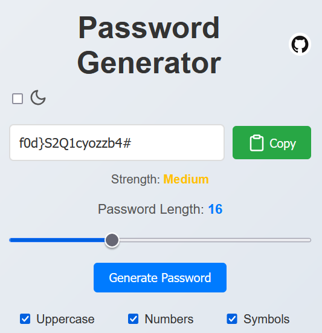
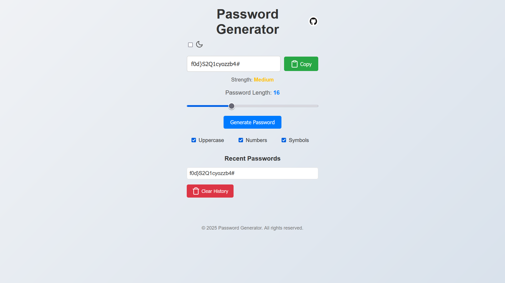
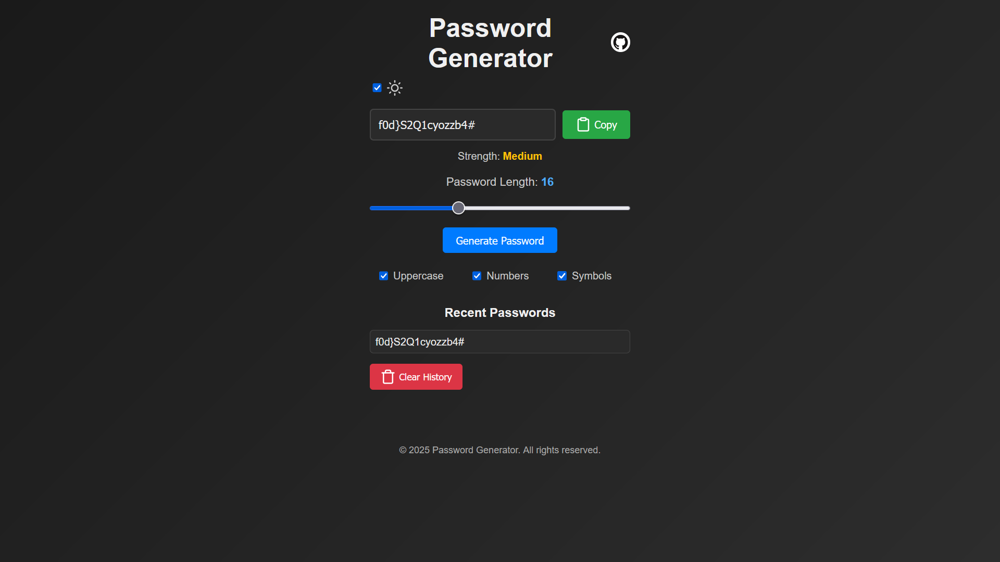

# Password Generator



A simple and secure password generator web application. Generate strong, random passwords with customizable options such as length, uppercase letters, numbers, and symbols. Includes a dark mode theme and password history feature.

## Features

- **Customizable Password Length**: Generate passwords between 8 and 32 characters.
- **Character Options**: Include uppercase letters, numbers, and symbols.
- **Password Strength Indicator**: Visual feedback on password strength (Weak, Medium, Strong).
- **Copy to Clipboard**: Easily copy generated passwords with one click.
- **Password History**: View and reuse recently generated passwords.
- **Dark Mode**: Toggle between light and dark themes for better usability.
- **Responsive Design**: Works seamlessly on desktop and mobile devices.

## Technologies Used

- **HTML5**: Structure of the web page.
- **CSS3**: Styling and animations, including dark mode transitions.
- **JavaScript**: Logic for password generation, clipboard functionality, and theme switching.

## How to Use

1. **Set Password Length**: Use the slider to choose the desired password length.
2. **Customize Characters**: Check or uncheck the options for uppercase letters, numbers, and symbols.
3. **Generate Password**: Click the "Generate Password" button to create a new password.
4. **Copy Password**: Click the "Copy" button to copy the password to your clipboard.
5. **View History**: Recently generated passwords are displayed in the history section. Click on a password to copy it again.
6. **Clear History**: Use the "Clear History" button to remove all saved passwords.
7. **Toggle Dark Mode**: Switch between light and dark themes using the theme toggle in the header.

## Installation

To run this project locally, follow these steps:

1. Clone the repository:
   ```bash
   git clone https://github.com/your-username/password-generator.git

2. Navigate to the project directory:
   ```bash
   cd password-generator

3. Open the index.html file in your browser.

## Live Demo
Check out the live demo of the project [here](https://github.com/Lucaas-o/PasswordGenerator).

## Contributing

Contributions are welcome! If you'd like to contribute, please follow these steps:

  1.  Fork the repository.
  2.  Create a new branch for your feature or bugfix.
  3.  Commit your changes.
  4.  Push your branch and submit a pull request.

Please ensure your code follows the existing style and includes appropriate tests.

## License
This project is licensed under the MIT License. See the [LICENSE](./LICENSE) file for details.

## Screenshots



## Author

Lucas - [GitHub Profile](https://github.com/Lucaas-o)